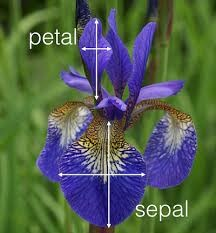
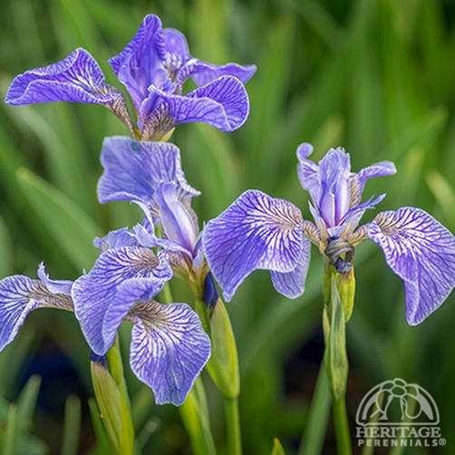
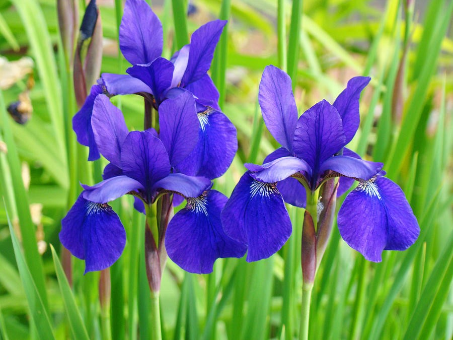

# Readme for Data Vis Project

# About the autor

Ok so this is my first attempt at a readme.
Heidi Beezub
Grad Student 
Mercyhurst University
DATA 550 Data Visualization
First Project iris data

This is a data visualization project.  

#Why should you use this code or be interested in it?
If you are working on a visualization project & don't know anything about Kaggle or programming you may be able to benefit from my comments.

#This repository contains:

1. The project word documnet"Iris dataset" (the basis for this readme)
2. 4 pictures
  a. what a petal & sepal are on an iris
  b. Iris-sentosa
  c. Iris versicolor
  d. Iris-Virginica
3. The iris dtata set of 150 sets of measurements (50 sets from each species.
4. The iris dataset.
5. My Jupiter notebook.
6. Iris data set assignment.
7. Readme

## Table of Contents

- [Background](#background)
- [Install](#install)
- [Usage](#usage)
- [Related Efforts](#related-efforts)
- [Project Explaination](#Project-explaination)
- [License](#license)

## Background

a. The dataset consists of an excel file.  There is a sample of 150 rows/entries (50 entries for each of 3 iris species).  The data parameters are "Id" (the row #), "SepalLengthCm", "SepalWidthCm", "PetalLengthCm",  "PetalWidthCm", and "Species."

b. The three iris species are "Iris-setosa" (ID numbers 1-50), "Iris-versicolor" (ID# 51-100), and "Iris-virginica" (ID# 101-150).  Note that there are over 200 species of iris, so this data is limited to 3 specific ones.

c. The 4 parameters having to do with Petal & Sepal width & length need a little explaining to know what (exactly) on an Iris is considered a petal & a sepal. The three sepals droop downwards and the three petals stand upright behind the sepal bases.

2) Select one of the kernels that include visualizations, and you are interested in reproducing/learning. 
a. Since I don't have any python experience (aside from the intro to python class I am currently taking) I needed to select a very simple & very basic kernel.  The kernel I selected was "Iris Species-Python Data Visualizations by Ben Hammer." This had 570 votes and based on the comments it appeared it would be easy for someone with no programming experience to use.

3) Copy the kernel in your python code. This does not mean that you can simply copy and paste.  It will require you to understand the code of someone else's and EXPLAIN everything that is included in the code in your own words.  So, you will include a write-up for every line of code in your GitHub submission (not necessary to include in the Kaggle submission). 

a. I first copied the code into a jupiter notebook, line by line so that I could try to determine what each line was doing.

b.  At first, I could not get anything to work even though I had installed/imported the packages/modules listed as needed.  I did not realize that there was an additional tab with the data that had to be downloaded & a zip file that had to be opened/saved.

c.  There were several types of graphs, scatter plots, box plots, violin graphs, line graphs, a pair plot which was a series of 16 graphs organizing the data in various ways and a couple of Andrews curves.  The various types of graphs appears to be there "just to be there."  The box plots are probably the most useful in showing the data and outliers for each species.  The scatter graphs that included color are a good visual to show the distribution between the species.  The least useful were the Andrews curves; these melded the data together.  When I first looked at them my immediate though was it would be something a VP would like it is impressive but doesn't tell you anything.  The violin plots I did not find useful as I have no idea how to read them.  The pair plots, while visually appealing again don't really tell much a story-just appear to be impressive to look at.

4) Once the code is understood and clear, you can start tweaking something - this part is something you will do with whatever you are comfortable doing (i.e., color, axes, 3D, the shape, horizontal/vertical, titles, legends, etc.) For the first part of the project, I will not ask you to do more than 2 (two) of these tweakings, but please feel free to do more. 

The goals for this repository are:

Complete the assignment
This first time, I am not assigning points to each of these headings because I want you to learn the process very well, but regarding importance here is the ranking I have in mind:
Section 3 - explaining everything
Section 5 - successfully posting it on Github and Kaggle and including a detailed readme
Section 1 - familiarity with the dataset
Section 4 - tweaking something
Section 2 - selecting a kernel

## Install

This project uses 
Python & the following python packages
pandas
seaborn
matplotlib

## Usage

This is a class project.

## Related Efforts

Ther are several other studentsin the Fall 2017 Data Visualizatin Class doing similar projects.

## Project Explaination
Explaination of Jupitern notebook code:
5) Finally, all the work will need to post on Github (including a detailed readme file an explanation for every line of code), and Kaggle. Please make sure that your Github readme files include a table, italics, headings, bold, or whatever you want - but it needs to use Github markdowns and looks visually presentable. 

Line 1: Import python package Pandas (a Python package for working with data)

Line 2: Imports python seaborn (a Python graphing library) and Python matplotlib (a Python plotting library) he color just sets the background & black text color.  The Seaborn package generates warnings that we don't want to see, so there is a "warning" code to suppress them.

Line 3: imports the excel data as a csv file (this is where I was initially having some problems as I didn't know this needed to be downloaded.  The "pd" is the name of the variable for the data set. 

Line 4: ".head" command shows the first few rows of the data. 

Line 5: ".value counts()" command gives a subtotal of the data by species

Line6: (new) gives a subtotal of the different values in the "PetalWidthCm".  This provides some basic distribution information.  (If that was something that we are interested in.

Line7: Is a basic scatter plot of the information.  There is no differentiation between species, so it doesn't tell us much information about the differences we are looking to see.

Line8: Is a similar scatter plot graph using the seaborn package (instead of Pandas).  The Pandas scatterplot is nicer visually.

Line 9 is another seaborn scatter plot, but this has added color to separate the species.  I have changed the colors from the default red blue green to a "muted" color palate.

Line 10 is a seaborn box plot.  I've changed the colors from the rbg to blues.  I like this graphic as it shows where the bulk of the data is for each species & then shows the outliers.

Line 11: is another box plot with stripplot.  The "jitter" of the dots in the strip plot helps to show the distribution.  Again, I've updated the colors & made the dots coordinating colors. 

Line12:  This is the violin plot that I did not think was very telling.  I've made it a combined plot like the above example adding the dots from the stripplot.  I changed the color palate to be the same as the previous example for comparison.  It makes a little more sense, the shape of the plots are supposed to show the distribution.

Line 13: is a line graph which nicely shows the difference between each species.  I have left these colors the original RGB.

Line 14: is the pair plot.  I find this visually too busy.  If you had a very academic audience, this may be a good visual as it "slices & dices" the data two different ways showing the x& Y axis or each of the 4 measurements.  However I think for most presentations that need to be very simple to be understood this is just too overwhelming.    I changed the color from the standard GRB to greens.

Line 15:  Is another pair plot, however instead of the default plots, the  'diag_kind="kde" ' command specifies we want a line plot down the diagonal.  I've left the colors the standard RBG.

Line16: This "drop" shows the series of 4 box plots (one for each measurement).  These are nice to see one beside the other.  However since the graphs have to include the total measurements for length & width, there is a lot of whitespace in the graphs and the box plots are rather small.  I tried making them larger, but the plots still look "small."  When I think of a presentation, it would make a better visual to make each graph individually & then show them "complete" side by side. This plot is back to the "pandas" package.

Line 17:  The "Andrews curve" graph.  Although it is interesting visually (and the default color palate seem to coordinate better.  It needs some explaining in order to know what it means (and graphs should really be self-explanatory).  According to the notes in the Kaggle kernel "Andrews Curves involve using attributes of samples as coefficients for Fourier series and then plotting these."  

Line18: Somewhat similar to the Andrews curve, this "parallel coordinates" graph at least identifies the parameters for the measurements.  Again this is visually appealing, however it doesn't show distinct differences.  The data appears to overlap with the petal width appearing to be the only parameter with distinct differences.  Again, (at least for this data) I don't find this type of graph overly informative.	

Line 19:  This last "radvis" graph also needs some explaining "A final multivariate visualization technique pandas has is radviz which puts each feature as a point on a 2D plane, and then simulates having each sample attached to those points through a spring weighted by the relative value for that feature".  If it needs that much of an introduction, it isn't easily understood.

## License
none

#Iris Sentosa 
 

#Iris Versicolor
 

#Iris Virginica
 